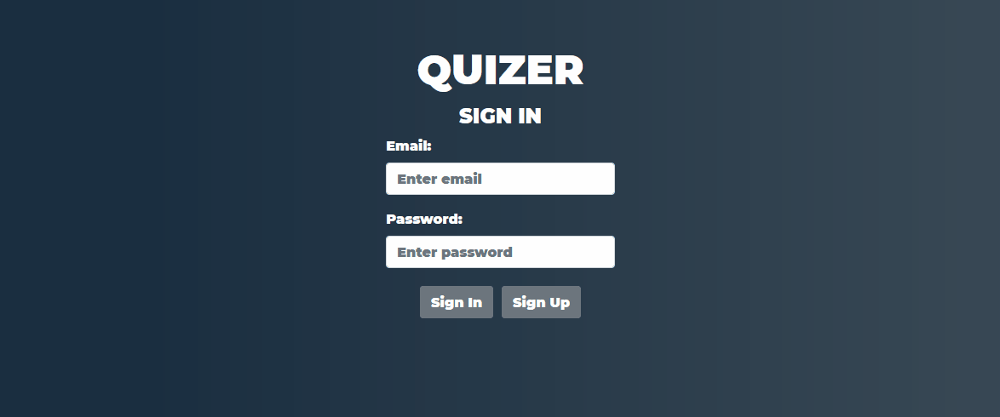

# Quizgame



```
Backend: Express + Mongoose
```
```
Frontend: Vue + Bootstrap
```
```
Api: Open Trivia DB
```
### Project setup
```
npm install
```

### Compiles frontend and hot-reloads for development
```
npm run serve
```

### Compiles frontend and minifies for production
```
npm run build
```

### Customize configuration
See [Configuration Reference](https://cli.vuejs.org/config/).


### Contains backend library (quizer-backend)
```
cd quizer-backend && nodemon app.js
```
